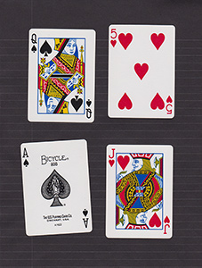
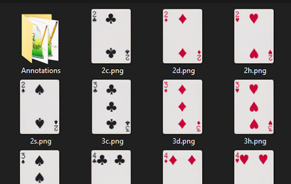
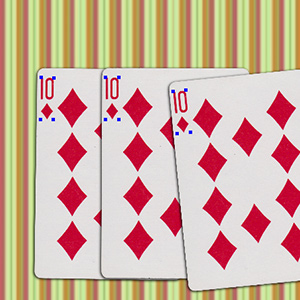
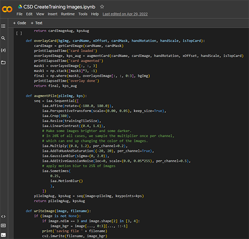
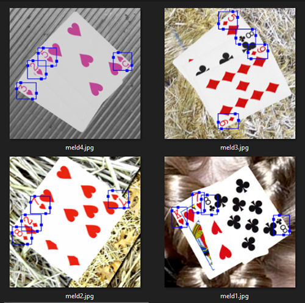
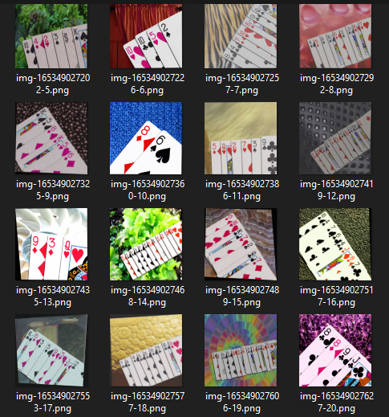
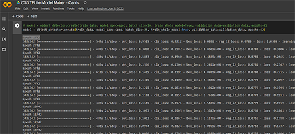
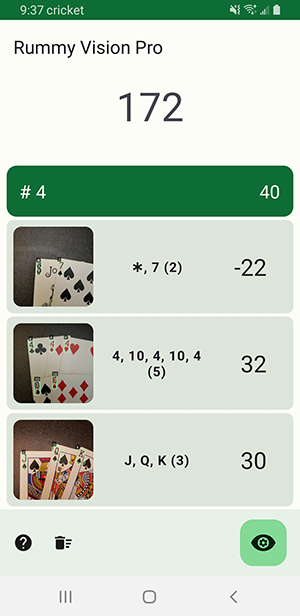
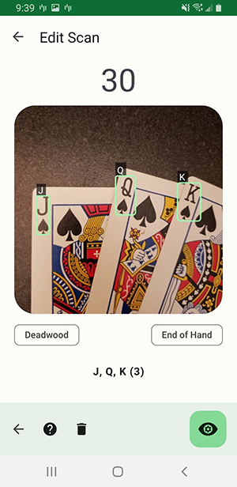

# Rummy Vision Pro - Neural Network Object Detection

Rummy Vision Pro is an Android application built to explore Neural Network design and usage. The use case was to create a scoring app for the playing card game Rummy. An Android application was written to use the network to detect and score melds.

[Rummy Vision Pro](https://play.google.com/store/apps/details?id=com.coresoftwaredesign.rummyvisionpro) is available for Android devices on Google Play.

### Design

A neural network was trained on playing card images.

The initial proof of concept was designed around a Yolo4-tiny convolutional neural network trained and implemented via the [Darknet Framework](https://github.com/pjreddie/darknet). Windows and Android proof-of-concept apps were built using the model. However, there were multiple issues integrating OpenCV, NVidia CUDA and the Android hardware.

Next, a EfficientDet-Lite2 model from the [TensorFlow-Lite Framework](https://www.tensorflow.org/lite/android) was evaluated. The EfficientDet-Lite2 model was selected as it offered a reasonable frame rate while still minimizing the size required by mobile apps.

| Model architecture | Size(MB)* | Latency(ms)** | Average Precision*** |
|--------------------|-----------|---------------|----------------------|
| EfficientDet-Lite0 | 4.4       | 37            | 25.69%               |
| EfficientDet-Lite1 | 5.8       | 49            | 30.55%               |
| EfficientDet-Lite2 | 7.2       | 69            | 33.97%               |
| EfficientDet-Lite3 | 11.4      | 116           | 37.70%               |
| EfficientDet-Lite4 | 19.9      | 260           | 41.96%               |

\* Size of the integer quantized models.
\*\* Latency measured on Pixel 4 using 4 threads on CPU.
\*\*\* Average Precision is the mAP (mean Average Precision) on the COCO 2017 validation dataset.

- 53 classes * 1000 ROI's per class = 53,000 ROI's, round to 54K.
- 60/20/20 training/validation/test split gives 54K/18K/18K.
- 90K total ROI's required.
- Assuming an average of 6-7 cards per image, we require a dataset of 13,702 images.

Rummy Vision Pro - Neural Network Visualization [(SVG)](docs/images/card_vision.tflite.svg) [(PNG)](docs/images/card_vision.tflite.png)

## Asset Preparation

It was determined manually photographing and tagging thousands of training images would be too labor intensive. Instead, image augmentation techniques were used to generate synthetic images for training. A deck of [Bicycle Rider Back Playing Cards (Poker 808)](https://bicyclecards.com/shop/bicycle-standard-index-808-playing-cards-black-10015510) were scanned, cropped, and normalized. Playing card scanning and preparation was one hour.

### Card Scanning Process

- Four cards at a time where scanned on flatbed scanner using Photoshop. 
- Photoshop Automate/Crop and Straighten was used to split and process each card.
- Raw card scan widths ranged from 739-744. Height ranged from 1034 to 1071.
- Used Photoshop batch processing to normalized all cards to 741 x 1053.

### Bounding Box Detection

The bounding box data was automatically extracted via Python and OpenCV scripts written to find the best-fitting bounding box for each pip. Photoshop was used for manual spot checking when necessary.

### Training Scene Generation

The goal is to create images with the same visual characteristics as a mobile phone video camera. Metadata containing which classes (cards) are selected and the bounding boxes of the corner 'pips' is created.

The scripts are written in Python and use [OpenCV](https://opencv.org/) (cv2), [imgaug](https://imgaug.readthedocs.io/), and [Pillow](https://pypi.org/project/Pillow/) (PIL) libraries.

Backgrounds were obtained from [Describable Textures Dataset (DTD)](https://www.robots.ox.ac.uk/~vgg/data/dtd/). DTD is a texture database, consisting of 5640 images.

[Google CoLab](https://colab.research.google.com/) GPU/TPU resources were used for image generation and training.

### Image Augmentation

- A random background is chosen.
- One to thirteen random cards (classes) are selected.
- The second, inverted pip of the top card is masked to prevent it from affecting the training.
- Card positions, spacing, rotations are randomized. Bounding boxes are adjusted accordingly.
- Drop shadows are generated at card edges to increase realism.
- Gaussian blur, brightness, and contrast are randomized. Random noise is injected. This is critical to prevent overtraining.
- A random amount of motion blur is applied to 25% of the images.

## Model Training

The model was trained on Google CoLab using the TensorFlow Lite Model Maker workflow. EfficientDet-Lite2 was selected as it had the best performance while being small enough to fit on a mobile device. Default image size is 448 x 448. Training consisted of:

- Loading training images and annotations (465 MB).
- Loading pre-trained EfficientDet-Lite2 model trained on the COCO dataset.
- Start TensorFlow Lite Model Maker training process.
- Terminate process when error/loss level is acceptable.
- Training took 42 epochs at approximately 500 sec per epoch (~6 hrs.).
- Validate model against test images.

## Android Application

An application was created to use the trained neural network to detect playing cards. The scoring logic for the standard rules of [Rummy](https://bicyclecards.com/how-to-play/rummy-rum) is implemented. The app can save scan metadata and images for listing, editing, and modification.

### App Design

The application design follows a simple list / detail CRUD pattern. The [TensorFlow-Lite Framework](https://www.tensorflow.org/lite/android) was selected as it integrated with the Android platform and was well supported.

The code is designed using Model-View-ViewModel (MVVM) architecture and leverages LiveData for uni-directional communication between layers. Features include:

- Written in Kotlin
- Tensorflow
- CameraX
- Material Design 3
- Jetpack Navigation Library
- ViewModel and LiveData
- Manual factory-based dependency injection
- Single Activity - Multiple Fragment app architecture
- Google Firebase Analytics, Remote Configuration, and Crash Reporting
- AdMob Interstitial Ads

&nbsp;&nbsp;&nbsp;&nbsp;
